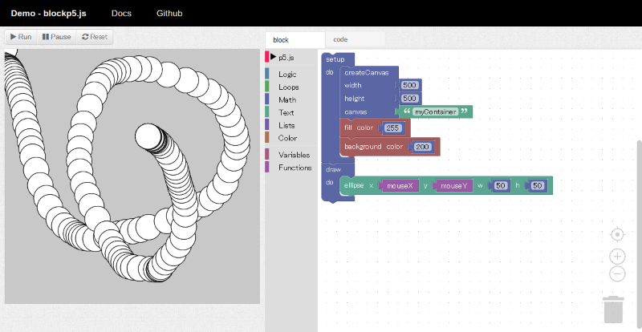

# blockp5.js = p5.js + blockly

p5.js と Blockly による、ブロックプログラミングのサンプル。

## リンク

- [デモ](https://ycatch.github.io/blockp5.js/example.html)
- [github](https://github.com/ycatch/blockp5.js)

## カスタムブロック

1. [Blockly Developer Tools](https://developers.google.com/blockly/guides/create-custom-blocks/blockly-developer-tools) を使う.
2. p5/blocks と p5/blocks_code に、ブロックファイルを保存する.
3. p5_block.js と p5_code.js に、ブロックファイルをマージする.

参考：[Blockly1.0：カスタムブロックの作り方](http://www.catch.jp/wiki/index.php?Blockly%2FCustomBlock).

## ライセンス

Released under the MIT License. Please see LICENSE.

All Components have their own license.

## コンポーネント

- [Blockly](https://developers.google.com/blockly/), [github](https://github.com/google/blockly)

- [p5.js](https://p5js.org/), [github](https://github.com/processing/p5.js)

- [prism.js](http://prismjs.com/), [github](https://github.com/PrismJS/prism)

- [Bootstrap4](https://getbootstrap.com/)
- [Font Awesome](http://fontawesome.io/)
